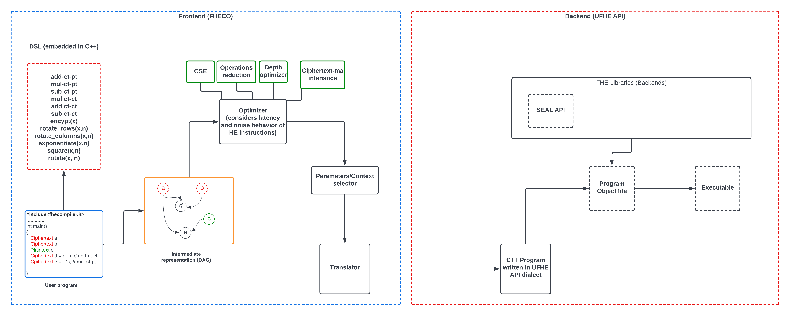

## Overview

FHECO is a compiler for FHE applications. FHECO provides a DSL embedded in C++ as well as various optimizations.



### Example

The following is an example of an FHE prgram written with FHECO. The program applies a 3x3 sharpening_filter on a 4x4 image.

* Note : Parameters selection is supposed to be done by the compiler during compile time, however in this example we show that the user can do it manually while writing his input program except for plaintext modulus where it is required to introduce it before compilation, and in case the user parameters set is better than one figured by the compiler, the compiler will generate what was introduced by the user.

```cpp
#include "fhecompiler.hpp"
#include <bits/stdc++.h> // It's not the best thing to do, but this is just for testing 

using namespace std;

std::vector<int64_t> flatten_image(const std::vector<vector<int64_t>> img)
{
  // this is the encoding procedure
  std::vector<int64_t> encoded_image;
  for (auto &row : img)
  {
    for (auto &e : row)
      encoded_image.push_back(e);
  }
  return encoded_image;
}

fhecompiler::Ciphertext simple_sharpening_filter(fhecompiler::Ciphertext &img, int n)
{
  fhecompiler::Ciphertext r0 = img * -8;
  fhecompiler::Ciphertext r1 = img << -n - 1;
  fhecompiler::Ciphertext r2 = img << -n;
  fhecompiler::Ciphertext r3 = img << -n + 1;
  fhecompiler::Ciphertext r4 = img << -1;
  fhecompiler::Ciphertext r5 = img << 1;
  fhecompiler::Ciphertext r6 = img << n - 1;
  fhecompiler::Ciphertext r7 = img << n;
  fhecompiler::Ciphertext r8 = img << n + 1;
  return 2 * img - (r0 + r1 + r2 + r3 + r4 + r5 + r6 + r7 + r8);
}

int main()
{
  try
  {
    fhecompiler::init("sharpening_filter", fhecompiler::Scheme::bfv, fhecompiler::Backend::SEAL);

    fhecompiler::Ciphertext output1("output1", fhecompiler::VarType::output);

    params_selector::EncryptionParameters params;

    params.set_coef_modulus({50, 50, 50});
    params.set_plaintext_modulus(786433);
    params.set_polynomial_modulus_degree(4096 * 2);

    std::vector<vector<int64_t>> img_clear = {{1, 2, 3, 4}, {5, 6, 7, 8}, {1, 2, 4, 7}, {12, 1, 2, 2}};

    // flatten image
    std::vector<int64_t> img_encoded = flatten_image(img_clear);

    fhecompiler::Plaintext img_plain(img_encoded);

    fhecompiler::Ciphertext img_cipher = fhecompiler::Ciphertext::encrypt(img_plain);

    fhecompiler::Ciphertext output3("output3", fhecompiler::VarType::output);
    output3 = simple_sharpening_filter(img_cipher, 4);

    fhecompiler::compile("sharpening_filter.hpp", &params);
  }
  catch (const char *message)
  {
    std::cout << message << "\n";
  }
  return 0;
}
```

Here's the generated code.

```cpp
#include"ufhe.hpp"
#inlcude<bits/stdc++.h> // It's not the best thing to do, but this is just for testing 

EncryptionContext create_context()
{
  EncryptionParameters params(scheme_type::bfv);
  params.set_poly_modulus_degree(8192);
  std::vector<int> coef_mod = {50, 50, 50};
  params.set_coeff_modulus(CoeffModulus::Create(8192, coef_mod));
  params.set_plain_modulus(786433);
  EncryptionContext context(params);
  return context;
}
void sharpening_filter(std::unordered_map<std::string, Ciphertext> &encrypted_inputs,
                       std::unordered_map<std::string, Plaintext> &encoded_inputs,
                       std::unordered_map<std::string, Ciphertext> &encrypted_outputs,
                       std::unordered_map<std::string, Plaintext> &encoded_outputs, const EncryptionContext &context,
                       const RelinKeys &relin_keys, const GaloisKeys &galois_keys, const PublicKey &public_key)
{
  BatchEncoder encoder(context);
  vector<int64_t> plaintext4_clear = {1, 2, 3, 4, 5, 6, 7, 8, 1, 2, 4, 7, 12, 1, 2, 2};
  Plaintext plaintext4;
  encoder.encode(plaintext4_clear, plaintext4);
  Encryptor encryptor(context, public_key);
  Ciphertext ciphertext30;
  encryptor.encrypt(plaintext4, ciphertext30);
  Evaluator evaluator(context);
  Ciphertext ciphertext40;
  evaluator.rotate_rows(ciphertext30, 5, galois_keys, ciphertext40);
  Ciphertext ciphertext39;
  evaluator.rotate_rows(ciphertext30, 4, galois_keys, ciphertext39);
  Ciphertext ciphertext38;
  evaluator.rotate_rows(ciphertext30, 3, galois_keys, ciphertext38);
  Ciphertext ciphertext37;
  evaluator.rotate_rows(ciphertext30, 1, galois_keys, ciphertext37);
  Ciphertext ciphertext36;
  evaluator.rotate_rows(ciphertext30, -1, galois_keys, ciphertext36);
  Ciphertext ciphertext35;
  evaluator.rotate_rows(ciphertext30, -3, galois_keys, ciphertext35);
  Ciphertext ciphertext34;
  evaluator.rotate_rows(ciphertext30, -4, galois_keys, ciphertext34);
  Ciphertext ciphertext33;
  evaluator.rotate_rows(ciphertext30, -5, galois_keys, ciphertext33);
  vector<int64_t> scalar0_clear(4096);
  for (size_t i = 0; i < 4096; i++)
  {
    scalar0_clear[i] = -8;
  }
  Plaintext scalar0;
  encoder.encode(scalar0_clear, scalar0);
  Ciphertext ciphertext32;
  evaluator.multiply_plain(ciphertext30, scalar0, ciphertext32);
  evaluator.add_inplace(ciphertext32, ciphertext33);
  evaluator.add_inplace(ciphertext32, ciphertext34);
  evaluator.add_inplace(ciphertext32, ciphertext35);
  evaluator.add_inplace(ciphertext32, ciphertext36);
  evaluator.add_inplace(ciphertext32, ciphertext37);
  evaluator.add_inplace(ciphertext32, ciphertext38);
  evaluator.add_inplace(ciphertext32, ciphertext39);
  evaluator.add_inplace(ciphertext32, ciphertext40);
  vector<int64_t> scalar1_clear(4096);
  for (size_t i = 0; i < 4096; i++)
  {
    scalar1_clear[i] = 2;
  }
  Plaintext scalar1;
  encoder.encode(scalar1_clear, scalar1);
  evaluator.multiply_plain_inplace(ciphertext30, scalar1);
  evaluator.sub_inplace(ciphertext30, ciphertext32);
  Ciphertext output3 = ciphertext30;
  encrypted_outputs.insert({"output3", output3});
}
```

## Building FHECO Manually

This section provides a short description of how to build FHECO. 

#### Prerequisites

###### Required
1) [CMake](https://cmake.org/): version 3.22.1 or greater.

2) [Autoconf](https://www.gnu.org/software/autoconf/) and [libtool](https://www.gnu.org/software/libtool/).

3) A C++ compiler that supports C++17.

SEAL4.0 is a required dependency but it is already included with the project.
  
###### Optional

#### Building

1) Get FHECO
```bash
git clone https://github.com/imadchabounia/fhecompiler_work.git
cd fhecompiler_work
```
2) Inside main directory run the following commands.
```bash
cd build
cmake -S ..
sudo make install
```
## Getting Started

## Run Tests
